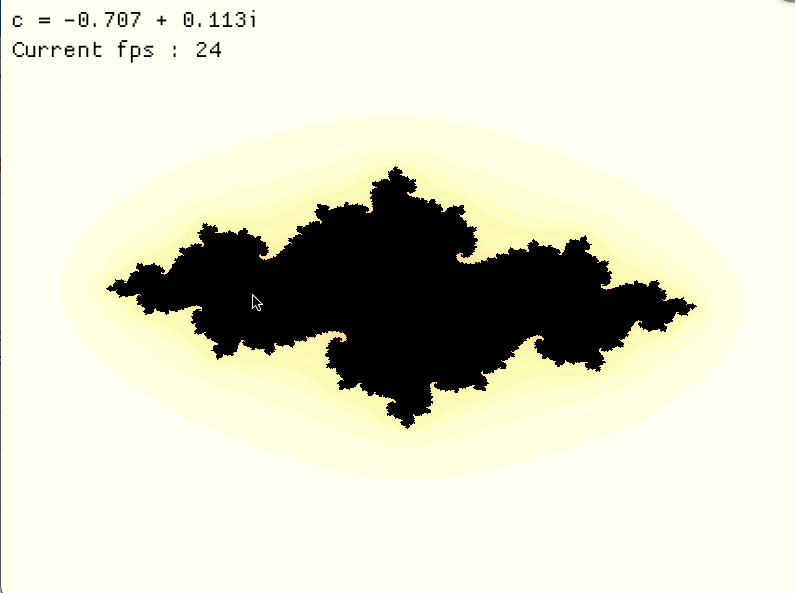

# Julia Set Renderer



## About
A real-time renderer for **Julia sets** defined by the iterative map:

$$z_{n+1} = z_n^2 + c$$

The application allows interactive exploration of fractal geometry by
continuously varying the complex parameter $c$.

---

## Motivation

Julia sets provide a concrete bridge between:
- Complex dynamics
- Chaos theory
- Fractal geometry

This projetcs focuses on **interactive exploration**, enabling intuition about how small parameter changes radicallt affect global structure.

--- 

## Features

- Real-time Julia set rendering
- Interactive control of parameter $c$
- Zooming, panning and freezing
- High-performance Rust implementation

--- 

## Installation

```bash
git clone https://github.com/luca-dupont2/Julia_Renderer.git
cd Julia_Renderer
```

---

## Usage
* Install Rust and Cargo (see [requirements](#Requirements))
* Run the renderer :
  ```console
  cargo run --release
  ```

---

## Controls

### Parameter Control

* Mouse movement: adjust the complex parameter $c$
* Space: freeze/unfreeze parameter updates

### Navigation

* ```+``` / ```-``` : Zoom in / out
* ```←``` ```→``` ```↓``` ```↑``` : Pan view

---

## Examples

<div style="display: flex; gap: 10px;">
  
  
  
  
</div>

--- 

## Mathematical background

Each pixel corresponds to an initial value $$z_0 \in \mathbb{C}$$.
The color encodes the escape time under iteration of the quadratic map.


Different values of $c$ produce readically different dynamical behaviors, from connected fractals to totally disconnected dust.

--- 

## Requirements

- Rust / Cargo

Install via:
  ```console
  curl https://sh.rustup.rs -sSf | sh
  ```
(Windows users: download [rustup-init.exe](https://win.rustup.rs/) from the official Rust website.) 


